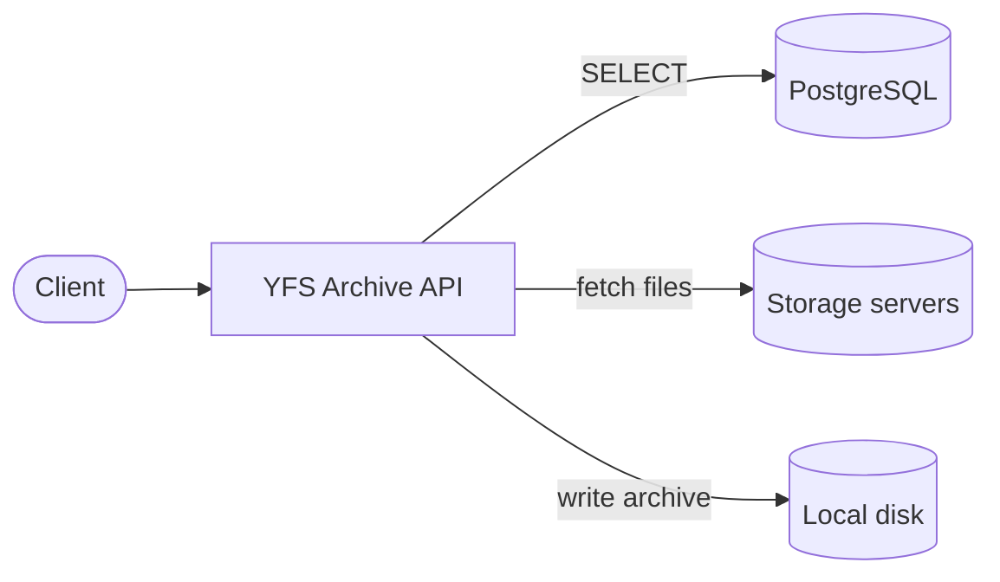

# YFS Archive API

**Turn any YFS folder tree into a downloadable ZIP or TAR archive, streamed straight from your storage servers, with live progress over Server-Sent Events.**

[](LICENSE)
[](https://golang.org/)

[Quick start](#quick-start) ·
[API](#api-reference) ·
[Configuration](#configuration) ·
[Contributing](CONTRIBUTING.md) ·
<a href="https://discord.com/invite/2BS7Z4FhJ" target="_blank" rel="noopener noreferrer">Discord</a>


---

## Table of contents

- [Overview](#overview)
- [Features](#features)
- [Architecture](#architecture)
- [Quick start](#quick-start)
- [Configuration](#configuration)
- [Storage servers](#storage-servers)
- [API reference](#api-reference)
- [Project layout](#project-layout)
- [Development](#development)
- [Roadmap](#roadmap)
- [Contributing](#contributing)
- [Security](#security)
- [Community and support](#community-and-support)
- [License](#license)

---

## Overview

YFS Archive API is a small, self-contained Go service. You give it a
`root_folder_id` and it:

1. walks the folder tree in PostgreSQL with a recursive CTE,
2. picks the **latest version** of every file,
3. streams each file's bytes from the storage server that holds it,
4. writes them into a single **ZIP** or **TAR** archive on local disk,
5. hands the client a **short-lived, job-scoped download token**.

All of this happens asynchronously. The client gets a job ID immediately
and follows progress live over SSE. Archives extract natively on macOS,
Linux and Windows.

The service is **read-only against PostgreSQL**. It only issues `SELECT`
statements and is designed to run with a database role that has no write
or DDL privileges.

## Features

- **Streaming end to end.** File bytes flow from storage to the archive
  writer to disk to the client without ever being held in memory as a whole.
- **ZIP (Deflate) or plain TAR** output, selected per request.
- **Live progress** over Server-Sent Events (`progress`, `completed`, `error`).
- **Token-protected downloads.** 256-bit random tokens, scoped to one job,
  with automatic expiry.
- **Bounded resources.** Fixed worker pool, bounded queue (HTTP 503 when
  full) and a hard archive size cap, checked both before and during
  generation.
- **Safe archive paths.** Every entry path is sanitised against `..`
  traversal, absolute paths, drive letters and NUL bytes.
- **Empty folders preserved** as explicit directory entries.
- **Graceful shutdown.** In-flight jobs are allowed to finish, and readiness
  flips to `503` first.
- **Structured JSON logging** (`log/slog`) with optional size- and age-based
  rotation.
- **Small, static binary.** Pure Go (`CGO_ENABLED=0`) on Alpine, with only
  four direct dependencies.
- **Pluggable backends.** Job store, token service and archive storage are
  interfaces, ready for Redis or S3 implementations.

## Architecture



Dependencies only point inward: `handler → service → repository / storage
/ client / archive`. Handlers never touch SQL or the filesystem directly,
and nothing outside `internal/config` reads environment variables.

## Quick start

### Prerequisites

- A PostgreSQL database with the expected schema, and a
  **read-only** role for this service.
- At least one row in the `servers` table pointing at a reachable
  [storage server](#storage-servers).
- Docker **or** Go 1.25+.

### Run with Docker

```bash
cp .env.example .env         # set DATABASE_URL and SELF_API_TOKEN at minimum
docker compose up -d
curl http://localhost:8080/healthz    # {"status":"ok"}
```

Or with plain `docker run`:

```bash
docker run -d --name yfs-archive-api \
  --env-file .env \
  -p 8080:8080 \
  -v yfs-archives:/app/archives \
  --stop-timeout 45 \
  rjyspl/yfs-archive-api:latest
```

See [DOCKERHUB.md](DOCKERHUB.md) for everything image-specific.

### Run from source

```bash
git clone https://github.com/Yukthi-Systems/YFS-Archive-API.git
cd YFS-Archive-API
cp .env.example .env         # set DATABASE_URL and SELF_API_TOKEN at minimum
go run ./cmd/server
```

### Create your first archive

```bash
# 1. Queue a job
curl -s -X POST http://localhost:8080/internal/archives \
  -H 'Content-Type: application/json' \
  -H "X-API-Token: $SELF_API_TOKEN" \
  -d '{"root_folder_id":"<folder-uuid>","archive_name":"Documents.zip","export_type":"zip"}'

# 2. Follow progress (prints the download token when done)
curl -N http://localhost:8080/archives/<job_id>/events

# 3. Download
curl -OJ "http://localhost:8080/archives/<job_id>/download?token=<download_token>"
```

## Configuration

All configuration comes from environment variables. A `.env` file in the
working directory is loaded automatically if present. Durations use Go
syntax (`500ms`, `30s`, `5m`, `1h`).

| Variable | Default | Description |
|---|---|---|
| **Required** | | |
| `DATABASE_URL` | — | PostgreSQL connection string. Use a `SELECT`-only role. |
| `ARCHIVE_TEMP_DIR` | — | Directory where archives are written. Created if missing. |
| `SELF_API_TOKEN` | — | Shared secret required in the `X-API-Token` header of `POST /internal/archives`. |
| **Server** | | |
| `APP_ENV` | `development` | Free-form label included in the startup log. |
| `SERVER_HOST` | `0.0.0.0` | Listen host. |
| `SERVER_PORT` | `8080` | Listen port. |
| `SERVER_PUBLIC_BASE_URL` | *(empty)* | Public origin prefixed to `events_url` and `download_url` (e.g. `https://archive.example.com`). Empty returns relative URLs. |
| `SERVER_READ_TIMEOUT` | `15s` | Applied as `ReadHeaderTimeout`. |
| `SERVER_WRITE_TIMEOUT` | `15s` | Parsed but intentionally **not** applied. See [timeouts](#timeouts). |
| `SERVER_IDLE_TIMEOUT` | `60s` | Keep-alive idle timeout. |
| `SERVER_SHUTDOWN_TIMEOUT` | `30s` | Maximum time to wait for in-flight jobs on shutdown. |
| **Database pool** | | |
| `DATABASE_MAX_CONNS` | `20` | Maximum pool size. |
| `DATABASE_MIN_CONNS` | `5` | Minimum idle connections. |
| `DATABASE_MAX_CONN_LIFETIME` | `30m` | Recycle connections after this long. |
| `DATABASE_MAX_CONN_IDLE_TIME` | `5m` | Close idle connections after this long. |
| **Archives** | | |
| `ARCHIVE_MAX_SIZE_BYTES` | `4294967296` | Hard cap (4 GiB), checked against the manifest and against bytes actually written. |
| `ARCHIVE_EXPIRY` | `1h` | Lifetime of a finished archive and its download token. |
| `ARCHIVE_WORKERS` | `4` | Number of archive jobs processed concurrently. |
| `ARCHIVE_QUEUE_SIZE` | `100` | Queue capacity. Further requests get `503`. |
| `ARCHIVE_CLEANUP_INTERVAL` | `10m` | How often expired jobs and orphaned files are removed. |
| `ARCHIVE_FILE_CONCURRENCY` | `4` | Reserved. Files are currently fetched sequentially per job. |
| **Storage** | | |
| `STORAGE_REQUEST_TIMEOUT` | `30s` | Time to receive response *headers* from a storage server. Body streaming is not time-limited. |
| **Logging** | | |
| `LOG_LEVEL` | `info` | `debug`, `info`, `warn` or `error`. |
| `LOG_OUTPUT` | `stdout` | `stdout`, `stderr` or `file`. |
| `LOG_FILE` | — | Log file path. Required when `LOG_OUTPUT=file`. |
| `LOG_MAX_SIZE_MB` | `100` | Rotate after this size. |
| `LOG_MAX_BACKUPS` | `10` | Rotated files to keep. |
| `LOG_MAX_AGE_DAYS` | `30` | Delete rotated files older than this. |
| `LOG_COMPRESS` | `true` | Gzip rotated files. |

### Timeouts

`http.Server.ReadTimeout` and `WriteTimeout` cover the *entire* request,
including streaming the response body. A 15 s write deadline would cut off
every large download and every SSE stream. So the server applies only
`ReadHeaderTimeout` and `IdleTimeout`, and relies on request contexts for
cancellation.

## Storage servers

Storage servers are loaded from the `servers` table **once at startup**, so
adding a server or rotating a key requires a restart. For each file, the
service calls the server whose `host_address` matches
`file_versions.hosted_at`:

```http
GET {host_address}/internal/files/download?file_location={file_location}
X-API-Token: {secret_key}
```

A storage server must:

- respond `2xx` with the raw file bytes as the body. Any other status fails
  the job.
- return exactly `file_size` bytes. TAR headers declare the size up front,
  so a mismatch fails the entry.

## API reference

| Method | Path | Purpose |
|---|---|---|
| `POST` | `/internal/archives` | Queue an archive job. **Internal only — do not expose publicly.** |
| `GET` | `/archives/{job_id}/events` | Follow job progress (SSE). |
| `GET` | `/archives/{job_id}/download?token=…` | Download a finished archive. |
| `GET` | `/healthz` | Liveness: `200 {"status":"ok"}` whenever the process is serving. |
| `GET` | `/readyz` | Readiness: `200 {"status":"ready"}`, or `503` during startup and shutdown. |

Every error response has the shape `{"error": "<safe message>"}`. Internal
details are logged, never returned.

### `POST /internal/archives`

Requires the header `X-API-Token: {SELF_API_TOKEN}`. A missing or wrong
token gets `401 Unauthorized`.

```json
{
  "root_folder_id": "08dcf8b0-3789-4ae3-97c8-014fc4f42dd8",
  "archive_name": "Documents.zip",
  "export_type": "zip"
}
```

| Field | Rules |
|---|---|
| `root_folder_id` | Required. UUID of a live folder. |
| `archive_name` | Required. 1–255 characters, no `/`, `\` or NUL. Used in `Content-Disposition`. |
| `export_type` | `"zip"` (default) or `"tar"`. |

**`202 Accepted`**

```json
{ "job_id": "8f4c…", "status": "queued", "events_url": "/archives/8f4c…/events", "expires_in": 3600 }
```

| Status | Meaning |
|---|---|
| `400` | Malformed JSON or failed validation. |
| `401` | Missing or invalid `X-API-Token`. |
| `404` | Root folder not found. |
| `503` | Queue full, or service shutting down. Retry with backoff. |

### `GET /archives/{job_id}/events`

A `text/event-stream` response. It sends the current state immediately,
then an event whenever progress changes (polled every 500 ms). The stream
closes after a `completed` or `error` event. Disconnecting does **not**
cancel the job.

```text
event: progress
data: {"processed_files":10,"total_files":50,"processed_bytes":524288000,"total_bytes":2147483648}

event: completed
data: {"job_id":"8f4c…","download_url":"/archives/8f4c…/download","download_token":"…","expires_in":3542}

event: error
data: {"message":"failed to generate archive"}
```

### `GET /archives/{job_id}/download?token=…`

Streams the archive with `Content-Type: application/zip` or
`application/x-tar`, and an RFC 5987 `Content-Disposition` filename
(Unicode-safe).

| Status | Meaning |
|---|---|
| `401` | Token missing, invalid, expired, or issued for another job. |
| `404` | Unknown or expired job. |
| `409` | Job exists but is not `completed` yet. |

## Project layout

The code follows the standard Go layout: one binary under `cmd/`, and all
implementation under `internal/` (not importable by other modules).

```text
.
├── cmd/server/          # main: wiring, startup, graceful shutdown
├── internal/
│   ├── archive/         # streaming ZIP/TAR writer + path sanitisation
│   ├── client/          # HTTP client for storage servers
│   ├── config/          # typed config loaded from env / .env
│   ├── handler/         # HTTP handlers (archive, SSE, download, health)
│   ├── job/             # job Store interface + in-memory implementation
│   ├── logger/          # slog JSON logger + lumberjack rotation
│   ├── model/           # shared domain types
│   ├── repository/      # all PostgreSQL access (pgx)
│   ├── server/          # routing, CORS, request logging
│   ├── service/         # business logic and job lifecycle
│   ├── storage/         # ArchiveStorage interface + local disk
│   ├── token/           # download token issuing/validation
│   └── worker/          # worker pool + cleanup sweep
├── .github/             # issue/PR templates, CI
├── Dockerfile
└── docker-compose.yml
```

Every package and exported identifier has a Go doc comment. Browse them
with `go doc ./internal/...` or on
[pkg.go.dev](https://pkg.go.dev/github.com/Yukthi-Systems/YFS-Archive-API).

## Development

```bash
go mod download
go build ./...                     # compile
go vet ./...                       # static checks
gofmt -l .                         # formatting (no output = clean)
go test -race ./...                # tests
go build -o bin/archive-service ./cmd/server
docker build --build-arg VERSION=dev -t rjyspl/yfs-archive-api:dev .
```

## Roadmap

- [ ] Resumable downloads (`Range` / `206 Partial Content`) for archives up to 50 GB
- [ ] Bounded parallel file fetching (`ARCHIVE_FILE_CONCURRENCY`)
- [ ] Redis-backed job store and token service
- [ ] S3 / MinIO archive storage
- [ ] Hot reload of the `servers` table
- [ ] Prometheus metrics endpoint

Have an idea? [Open a feature request](https://github.com/Yukthi-Systems/YFS-Archive-API/issues/new/choose).

## Contributing

Contributions of every size are welcome. Please read
[CONTRIBUTING.md](CONTRIBUTING.md) before opening a pull request, and follow
our [Code of Conduct](CODE_OF_CONDUCT.md).

## Security

Please **do not** report vulnerabilities in public issues. See
[SECURITY.md](SECURITY.md) for how to report them privately.

## Community and support

- 💬 **Discord:** <a href="https://discord.com/invite/2BS7Z4FhJ" target="_blank" rel="noopener noreferrer">discord.com/invite/2BS7Z4FhJ</a>
- 📧 **Email:** [connect@yukthi.com](mailto:connect@yukthi.com)
- 🐛 **Bugs & features:** [GitHub Issues](https://github.com/Yukthi-Systems/YFS-Archive-API/issues)

## License

Copyright © 2026 Yukthi Systems.

This program is free software: you can redistribute it and/or modify it
under the terms of the **GNU General Public License v3.0**. See
[LICENSE](LICENSE) for the full text.
